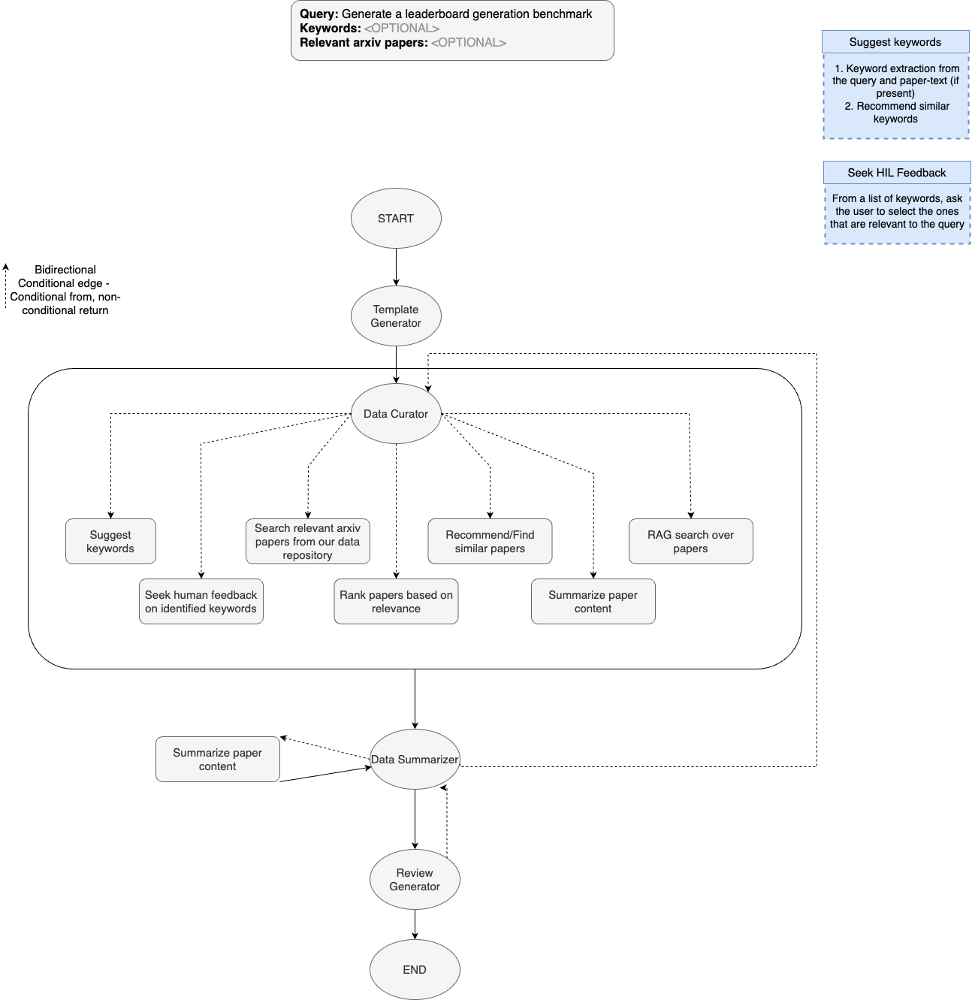

# Literature Review Agent System

An intelligent multi-agent system for automated literature review generation using LangGraph, FAISS, and Google Gemini models. This system automates the process of finding, ranking, summarizing, and synthesizing academic papers to create comprehensive literature reviews.

## 🎯 Overview

This project implements a sophisticated agent-based workflow that:
- Generates research questions based on user queries
- Suggests and refines keywords through human feedback
- Searches for relevant academic papers using FAISS vector search
- Ranks papers by relevance to the research query
- Extracts and summarizes key findings from papers
- Synthesizes information into coherent literature reviews
- Evaluates and iteratively improves the generated reviews

## 🏗️ Architecture

The system uses a **LangGraph state machine** with sophisticated multi-agent workflow for automated literature review generation.



### Agent Workflow

The workflow consists of the following key phases:

#### 1. **Template Generator** 
- **Purpose**: Creates structured research questions based on user's query
- **Input**: User research query
- **Output**: 7-10 specific research questions to guide the literature review

#### 2. **Keyword Management Pipeline**
- **Suggest Keywords**: AI-powered keyword generation using Gemini models
- **Human Feedback**: Interactive keyword editing and approval process
  - Add new keywords (`+keyword1,keyword2,...`)
  - Remove keywords (`-1,3,5` for positions)
  - Replace all (`=keyword1,keyword2,...`)

#### 3. **Data Curator (Multi-Tool Agent)**
The Data Curator is a sophisticated ReactAgent with access to multiple tools:

- **🔍 Search Papers**: FAISS-based semantic search using keywords
- **📊 Rank Papers**: AI-powered relevance ranking based on query
- **🔗 Find Similar Papers**: Discover papers similar to specific references
- **📝 Summarize Papers**: Generate detailed paper summaries

**Tool Execution Flow**:
```
Keywords → Search Papers → Rank by Relevance → Summarize Content
```

#### 4. **Data Summarizer**
- **Purpose**: Synthesizes individual paper summaries into coherent insights
- **Process**: Answers 3-5 key questions using aggregated paper content
- **Quality Check**: Returns "NO SUFFICIENT INFORMATION" if data is inadequate

#### 5. **Review Generator** 
- **Purpose**: Creates the final "Related Work" section
- **Input**: Synthesized data summary and original query
- **Output**: Academic-standard literature review with proper structure

#### 6. **Review Evaluator (Quality Control)**
- **Purpose**: Iterative quality assessment and improvement
- **Criteria**: Comprehensiveness, structure, critical analysis, coherence, academic style
- **Actions**: 
  - ✅ **ACCEPTABLE**: Route to END
  - ❌ **NEEDS IMPROVEMENT**: Route back to Data Summarizer with feedback

### Key Features of the Architecture

- **🔄 Iterative Refinement**: Feedback loops ensure quality improvement
- **🤖 Human-in-the-Loop**: Interactive keyword refinement process
- **⚡ Parallel Processing**: Efficient paper retrieval and processing
- **🛡️ Error Handling**: Graceful degradation when papers are inaccessible
- **📈 Scalability**: Configurable limits for large-scale processing

### Workflow Details

#### **Sequential Processing Flow**
1. **START** → **Template Generator** → **Data Curator**
2. **Data Curator** ↔ **Data Summarizer** (bidirectional feedback loop)
3. **Data Summarizer** → **Review Generator** → **END**

#### **Data Curator Internal Operations**
The Data Curator operates as a multi-tool agent with the following capabilities:

1. **Suggest Keywords**: 
   - Seeks human feedback on identified keywords
   - Allows interactive refinement and approval

2. **Search Agent**: 
   - Retrieves relevant arXiv papers from data repository
   - Uses FAISS vector search for semantic matching

3. **Recommend/Find Similar Papers**:
   - Discovers papers similar to found references
   - Expands the literature base through citation networks

4. **Rank Papers**: 
   - Orders papers based on relevance to query
   - Uses AI-powered ranking algorithms

5. **Summarize Paper Content**:
   - Generates detailed abstracts and key findings
   - Extracts methodology, results, and significance

6. **RAG Search**: 
   - Retrieval-Augmented Generation over papers
   - Enables contextual information extraction

#### **Quality Assurance Loop**
The system includes a sophisticated feedback mechanism:
- **Data Summarizer** evaluates information sufficiency
- **Review Generator** creates academic-standard output
- **Bidirectional communication** allows for iterative improvement
- **Human oversight** ensures quality and relevance

## 🔧 Prerequisites

### Required Dependencies

```bash
pip install langchain
pip install langgraph
pip install langchain-google-genai
pip install sentence-transformers
pip install faiss-cpu  # or faiss-gpu for GPU support
pip install PyMuPDF
pip install numpy
pip install requests
pip install torch
pip install bm25s
```

### Required Data Files

- `dataset/AP_TABS.pkl`: Paper abstracts and metadata
- `dataset/bm25_index.pkl`: BM25 search index
- FAISS index files:
  - `/path/to/faiss.index`: Vector embeddings index
  - `/path/to/paper_ids.npy`: Paper ID mappings

### API Keys

Set your Google Gemini API key:
```bash
export GEMINI_API_KEY="your_api_key_here"
```

## 🚀 Quick Start

### Basic Usage

```python
from literature_review import run_leaderboard_benchmark

# Run literature review generation
query = "Ion-Specific Effects in Colloid-Colloid Interactions"
result = run_leaderboard_benchmark(query)

print("Generated Review:")
print(result.get('review', 'No review generated'))
```

### Interactive Execution

```bash
python literature_review.py
```

The system will guide you through:
1. Reviewing and editing suggested keywords
2. Monitoring the paper search and ranking process
3. Viewing generated summaries and final review

## 🔍 Key Features

### Intelligent Paper Discovery

- **Vector Search**: Uses FAISS with Sentence Transformers for semantic paper retrieval
- **ArXiv Integration**: Automatic PDF download and text extraction
- **Relevance Ranking**: AI-powered paper ranking based on query relevance

### Multi-Modal Summarization

- **Structured Summaries**: Focuses on methodology, findings, and significance
- **Critical Analysis**: Goes beyond description to analyze implications
- **Synthesis**: Combines multiple paper insights into coherent narratives

### Quality Assurance

- **Iterative Improvement**: Feedback loops for continuous refinement
- **Academic Standards**: Evaluation based on comprehensiveness, structure, and coherence
- **Human-in-the-Loop**: Interactive keyword refinement and approval

### Robust Error Handling

- **Graceful Degradation**: Continues operation when some papers are inaccessible
- **Validation**: Checks for sufficient information before proceeding
- **Retry Logic**: Automatic retries for failed operations

## 📁 Project Structure

```
Agents-Project/
├── literature_review.py      # Main agent system
├── README.md                 # This file
├── dataset/                  # Data files (not included)
│   ├── AP_TABS.pkl          # Paper abstracts
│   └── bm25_index.pkl       # Search index
└── requirements.txt          # Dependencies (recommended)
```

## 🛠️ Configuration

### Model Settings

```python
# Sentence transformer model for embeddings
model = SentenceTransformer("all-mpnet-base-v2")

# FAISS search parameters
index.nprobe = 50  # Adjust based on index characteristics

# Paper limits
MAX_PAPERS_TO_SEARCH = 15
MAX_PAPERS_TO_SUMMARIZE = 15
```

### LLM Configuration

The system uses multiple Gemini API keys for different functions:
- Template generation
- Keyword suggestion  
- Paper ranking and summarization
- Review generation and evaluation

## 🔄 State Management

The system maintains state through a TypedDict structure:

```python
class State(TypedDict):
    query: str                    # User's research query
    template: str                 # Generated research questions
    keywords: List[str]           # Refined search keywords
    papers: List[str]             # Retrieved papers
    ranked_papers: List[str]      # Papers ranked by relevance
    summaries: List[dict]         # Paper summaries
    data_summary: str             # Synthesized insights
    review: str                   # Final literature review
    # ... additional state fields
```

## 🎛️ Available Tools

### Core Tools

- **`search_papers(keywords)`**: FAISS-based paper retrieval
- **`find_similar_papers(paper_name)`**: Find papers similar to a given paper
- **`rank_papers(papers, query)`**: AI-powered relevance ranking
- **`summarize_papers(papers)`**: Detailed paper summarization

### Utility Functions

- **`extract_text_from_arxiv(arxiv_id)`**: PDF download and text extraction
- **`fix_arxiv_id(arxiv_id)`**: ArXiv ID format normalization
- **`suggest_keywords_function()`**: Keyword generation with context

## 📊 Output Examples

### Generated Template Questions

```
1. What are the main theoretical frameworks for understanding ion-specific effects?
2. How do van der Waals interactions contribute to colloid-colloid potentials?
3. What experimental methods are used to measure these interactions?
4. How do different salt types affect the potential of mean force?
5. What are the current limitations in modeling these systems?
```

### Final Literature Review Structure

The generated reviews include:
- **Introduction to the Topic**: Context and significance
- **Theoretical Foundations**: Key concepts and frameworks  
- **Experimental Approaches**: Methods and techniques
- **Key Findings**: Major discoveries and results
- **Current Challenges**: Limitations and open questions
- **Future Directions**: Emerging trends and opportunities

## 🔧 Customization

### Adding New Tools

```python
@tool
def your_custom_tool(parameter: str) -> str:
    """
    Description of what your tool does.
    
    Args:
        parameter: Description of the parameter
        
    Returns:
        Description of the return value
    """
    # Implementation here
    return result
```

### Modifying the Workflow

```python
# Add new nodes
workflow.add_node("your_node", your_node_function)

# Add edges
workflow.add_edge("source_node", "your_node")
```

## 🐛 Troubleshooting

### Common Issues

1. **API Key Errors**: Ensure GEMINI_API_KEY is set correctly
2. **FAISS Index Missing**: Verify index files exist at specified paths
3. **Memory Issues**: Reduce MAX_PAPERS_TO_SUMMARIZE for large datasets
4. **Network Timeouts**: Check internet connection for ArXiv downloads

### Debug Mode

Enable verbose logging:
```python
import logging
logging.basicConfig(level=logging.DEBUG)
```

## 📚 References

- [LangGraph Documentation](https://langchain-ai.github.io/langgraph/)
- [FAISS Library](https://github.com/facebookresearch/faiss)
- [Sentence Transformers](https://www.sbert.net/)
- [ArXiv API](https://arxiv.org/help/api)

## 📄 License

This project is licensed under the MIT License - see the LICENSE file for details.

## 🤝 Contributing

1. Fork the repository
2. Create a feature branch (`git checkout -b feature/amazing-feature`)
3. Commit your changes (`git commit -m 'Add amazing feature'`)
4. Push to the branch (`git push origin feature/amazing-feature`)
5. Open a Pull Request

## 📞 Support

For questions and support, please open an issue in the GitHub repository.

---

**Note**: This system requires substantial computational resources for embedding generation and paper processing. Consider using GPU acceleration for large-scale literature reviews.